

  

  

  

 

  

  <strong style="color:black">Join the Discord</strong>
    
  

---

## 🌐 Live Deployments

<!-- AUTO_LIVE_START -->
 
 <a href="https://infinition.github.io/AcidPages/"></a>
<a href="https://infinition.github.io/AcidVect3D/"></a> <a href="https://infinition.github.io/AcidWiki/"></a>
 <a href="https://infinition.github.io/bjorn_dungeon/"></a>
<a href="https://infinition.github.io/cyberchef/"></a> <a href="https://infinition.github.io/DataBrain/"></a>
<a href="https://infinition.github.io/deep-math-academy/"></a> <a href="https://infinition.github.io/flappy-ufo-ql/"></a>
 <a href="https://infinition.github.io/Q-LAB-2D/"></a>
<a href="https://infinition.github.io/ScrabbleArt/"></a> <a href="https://infinition.github.io/SYNAPTIK/"></a>
<!-- AUTO_LIVE_END -->

---
---

## 🔵 VSCode Extensions

<!-- AUTO_VSCODE_START -->
<a href="https://infinition.github.io/AcidBjorn/"></a> <a href="https://infinition.github.io/AcidSnip/"></a>
<!-- AUTO_VSCODE_END -->

---

## 🟣 Obsidian Extensions

<!-- AUTO_OBSIDIAN_START -->
 
<a href="https://infinition.github.io/obsidian-lumina/"></a> <a href="https://infinition.github.io/obsidian-magic-folders/"></a>
<a href="https://infinition.github.io/obsidian-magiclink/"></a> <a href="https://infinition.github.io/obsidian-nova/"></a>
<a href="https://infinition.github.io/obsidian-obsidget/"></a> <a href="https://infinition.github.io/obsidian-python-ds-studio/"></a>
<!-- AUTO_OBSIDIAN_END -->

---

## 📂 Other Repositories

<!-- AUTO_OTHER_START -->
<a href="https://github.com/infinition/AcidLuna"></a> 
 
<a href="https://github.com/infinition/EPD-Emulator"></a> <a href="https://github.com/infinition/Excel-Sheet-PasswordCracker"></a>
<a href="https://github.com/infinition/P4wnP1-Infinition-Payloads"></a> <a href="https://github.com/infinition/PyDep"></a>
<a href="https://github.com/infinition/PyTreefy"></a> <a href="https://github.com/infinition/QRobot"></a>
<a href="https://github.com/infinition/Win10_LockPicker-by-Infinition"></a> <a href="https://github.com/infinition/Zombieland"></a>
<!-- AUTO_OTHER_END -->

---

  
<picture>
  <source 
    srcset="https://github-readme-stats.vercel.app/api?username=infinition&show_icons=true&theme=dark&hide_border=true&bg_color=0D1117&title_color=FF6B00&icon_color=FF6B00&text_color=FFFFFF&hide=issues,prs,contribs"
    media="(prefers-color-scheme: dark)"
  />
  <source
    srcset="https://github-readme-stats.vercel.app/api?username=infinition&show_icons=true&hide=issues,prs,contribs"
    media="(prefers-color-scheme: light), (prefers-color-scheme: no-preference)"
  />
  
</picture>

---

  
## 🛠️ Tech Stack
## 🛠️ Tech Stack

---

  
## 💬 Let's Connect!
## 💬 Let's Connect!
  

---

## 📊 Cyber Activity

