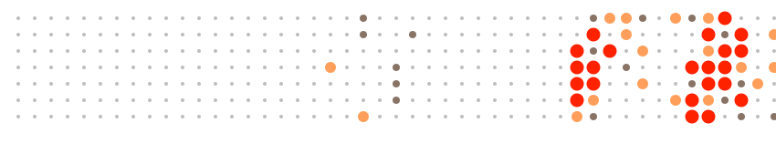

  

  

  

 

  

  <strong style="color:black">Join the Discord</strong>
    
  

 

### 🌐 Live Deployments

<!-- AUTO_LIVE_START -->
<table width="100%">
  <tr>
    <td width="8%" align="center" style="padding: 2px;">
      
    </td>
    <td width="5%" align="center" style="padding: 2px;">
      
    </td>
    <td width="5%" align="center" style="padding: 2px;">
      
    </td>
    <td width="18%" style="padding: 2px;">
      <strong><a href="https://github.com/infinition/infinition">infinition</a></strong>
    </td>
    <td style="padding: 2px;">
      <em>No description</em>
    </td>
    <td width="5%" align="center" style="padding: 2px;">
      
    </td>
  </tr>
  <tr>
    <td width="8%" align="center" style="padding: 2px;">
      
    </td>
    <td width="5%" align="center" style="padding: 2px;">
      
    </td>
    <td width="5%" align="center" style="padding: 2px;">
      
    </td>
    <td width="18%" style="padding: 2px;">
      <strong><a href="https://github.com/infinition/Bjorn">Bjorn</a></strong>
    </td>
    <td style="padding: 2px;">
      Bjorn is a powerful network scanning and offensive security tool for the Raspberry Pi with a 2.13-inch e-Paper HAT. It discovers network targets, identifies open ports, exposed services, and potential vulnerabilities. Bjorn can perform brute force attacks, file stealing, host zombification, and supports custom attack scripts.
    </td>
    <td width="5%" align="center" style="padding: 2px;">
      
    </td>
  </tr>
  <tr>
    <td width="8%" align="center" style="padding: 2px;">
      
    </td>
    <td width="5%" align="center" style="padding: 2px;">
      
    </td>
    <td width="5%" align="center" style="padding: 2px;">
      
    </td>
    <td width="18%" style="padding: 2px;">
      <strong><a href="https://github.com/infinition/Acid2Vect">Acid2Vect</a></strong>
    </td>
    <td style="padding: 2px;">
      Acid2Vect is a web application that allows you to convert images into vectors using the Acid2 library.
    </td>
    <td width="5%" align="center" style="padding: 2px;">
      
    </td>
  </tr>
  <tr>
    <td width="8%" align="center" style="padding: 2px;">
      
    </td>
    <td width="5%" align="center" style="padding: 2px;">
      
    </td>
    <td width="5%" align="center" style="padding: 2px;">
      
    </td>
    <td width="18%" style="padding: 2px;">
      <strong><a href="https://github.com/infinition/AcidLog">AcidLog</a></strong>
    </td>
    <td style="padding: 2px;">
      AcidLog is a real-time security monitoring and visualization tool designed for cybersecurity professionals. It provides an intuitive interface for tracking, analyzing, and responding to security events in real-time.
    </td>
    <td width="5%" align="center" style="padding: 2px;">
      
    </td>
  </tr>
  <tr>
    <td width="8%" align="center" style="padding: 2px;">
      
    </td>
    <td width="5%" align="center" style="padding: 2px;">
      
    </td>
    <td width="5%" align="center" style="padding: 2px;">
      
    </td>
    <td width="18%" style="padding: 2px;">
      <strong><a href="https://github.com/infinition/AcidOS">AcidOS</a></strong>
    </td>
    <td style="padding: 2px;">
      AcidOS is a fully functional desktop operating system simulator running entirely in the browser. No installation, no build tools, no Node.js required.
    </td>
    <td width="5%" align="center" style="padding: 2px;">
      
    </td>
  </tr>
  <tr>
    <td width="8%" align="center" style="padding: 2px;">
      
    </td>
    <td width="5%" align="center" style="padding: 2px;">
      
    </td>
    <td width="5%" align="center" style="padding: 2px;">
      
    </td>
    <td width="18%" style="padding: 2px;">
      <strong><a href="https://github.com/infinition/AcidPages">AcidPages</a></strong>
    </td>
    <td style="padding: 2px;">
      Web portal to scan Github Profiles for Deployed Sites
    </td>
    <td width="5%" align="center" style="padding: 2px;">
      
    </td>
  </tr>
  <tr>
    <td width="8%" align="center" style="padding: 2px;">
      
    </td>
    <td width="5%" align="center" style="padding: 2px;">
      
    </td>
    <td width="5%" align="center" style="padding: 2px;">
      
    </td>
    <td width="18%" style="padding: 2px;">
      <strong><a href="https://github.com/infinition/AcidVect3D">AcidVect3D</a></strong>
    </td>
    <td style="padding: 2px;">
      AcidVect3D is a 3D vector graphics editor that transform svg files into 3D models for 3D printing.
    </td>
    <td width="5%" align="center" style="padding: 2px;">
      
    </td>
  </tr>
  <tr>
    <td width="8%" align="center" style="padding: 2px;">
      
    </td>
    <td width="5%" align="center" style="padding: 2px;">
      
    </td>
    <td width="5%" align="center" style="padding: 2px;">
      
    </td>
    <td width="18%" style="padding: 2px;">
      <strong><a href="https://github.com/infinition/AcidWiki">AcidWiki</a></strong>
    </td>
    <td style="padding: 2px;">
      A modern, lightweight, and highly customizable wiki template designed for developers and documentation enthusiasts. Built with a focus on speed, aesthetics, and ease of use.
    </td>
    <td width="5%" align="center" style="padding: 2px;">
      
    </td>
  </tr>
  <tr>
    <td width="8%" align="center" style="padding: 2px;">
      
    </td>
    <td width="5%" align="center" style="padding: 2px;">
      
    </td>
    <td width="5%" align="center" style="padding: 2px;">
      
    </td>
    <td width="18%" style="padding: 2px;">
      <strong><a href="https://github.com/infinition/bjorn_dungeon">bjorn_dungeon</a></strong>
    </td>
    <td style="padding: 2px;">
      <em>No description</em>
    </td>
    <td width="5%" align="center" style="padding: 2px;">
      
    </td>
  </tr>
  <tr>
    <td width="8%" align="center" style="padding: 2px;">
      
    </td>
    <td width="5%" align="center" style="padding: 2px;">
      
    </td>
    <td width="5%" align="center" style="padding: 2px;">
      
    </td>
    <td width="18%" style="padding: 2px;">
      <strong><a href="https://github.com/infinition/cyberchef">cyberchef</a></strong>
    </td>
    <td style="padding: 2px;">
      Cyber chef is a cyberpunk-themed recipe management application. This application features a glassmorphism UI, advanced media management, and local persistence for all your culinary protocols.
    </td>
    <td width="5%" align="center" style="padding: 2px;">
      
    </td>
  </tr>
  <tr>
    <td width="8%" align="center" style="padding: 2px;">
      
    </td>
    <td width="5%" align="center" style="padding: 2px;">
      
    </td>
    <td width="5%" align="center" style="padding: 2px;">
      
    </td>
    <td width="18%" style="padding: 2px;">
      <strong><a href="https://github.com/infinition/DataBrain">DataBrain</a></strong>
    </td>
    <td style="padding: 2px;">
      DataBrain is a powerful, modular, and local-first knowledge management and learning platform designed to help you organize, learn, and create interactive content effortlessly. Built with a block-based architecture, it combines the flexibility of a notebook with the interactivity of a modern webapp.
    </td>
    <td width="5%" align="center" style="padding: 2px;">
      
    </td>
  </tr>
  <tr>
    <td width="8%" align="center" style="padding: 2px;">
      
    </td>
    <td width="5%" align="center" style="padding: 2px;">
      
    </td>
    <td width="5%" align="center" style="padding: 2px;">
      
    </td>
    <td width="18%" style="padding: 2px;">
      <strong><a href="https://github.com/infinition/deep-math-academy">deep-math-academy</a></strong>
    </td>
    <td style="padding: 2px;">
      🚀 Deep Math Academy : Les Fondamentaux Mathématiques pour l'IA
    </td>
    <td width="5%" align="center" style="padding: 2px;">
      
    </td>
  </tr>
  <tr>
    <td width="8%" align="center" style="padding: 2px;">
      
    </td>
    <td width="5%" align="center" style="padding: 2px;">
      
    </td>
    <td width="5%" align="center" style="padding: 2px;">
      
    </td>
    <td width="18%" style="padding: 2px;">
      <strong><a href="https://github.com/infinition/flappy-ufo-ql">flappy-ufo-ql</a></strong>
    </td>
    <td style="padding: 2px;">
       Flappy UFO game with reinforcement Learning running entirely in your browser.
    </td>
    <td width="5%" align="center" style="padding: 2px;">
      
    </td>
  </tr>
  <tr>
    <td width="8%" align="center" style="padding: 2px;">
      
    </td>
    <td width="5%" align="center" style="padding: 2px;">
      
    </td>
    <td width="5%" align="center" style="padding: 2px;">
      
    </td>
    <td width="18%" style="padding: 2px;">
      <strong><a href="https://github.com/infinition/Q-LAB-2D">Q-LAB-2D</a></strong>
    </td>
    <td style="padding: 2px;">
      A high-performance, zero-dependency visualization of Reinforcement Learning running entirely in your browser.
    </td>
    <td width="5%" align="center" style="padding: 2px;">
      
    </td>
  </tr>
  <tr>
    <td width="8%" align="center" style="padding: 2px;">
      
    </td>
    <td width="5%" align="center" style="padding: 2px;">
      
    </td>
    <td width="5%" align="center" style="padding: 2px;">
      
    </td>
    <td width="18%" style="padding: 2px;">
      <strong><a href="https://github.com/infinition/ScrabbleArt">ScrabbleArt</a></strong>
    </td>
    <td style="padding: 2px;">
      ScrabbleArt est un outil simple pour créer des mots croisés artistiques à partir de vos listes.
    </td>
    <td width="5%" align="center" style="padding: 2px;">
      
    </td>
  </tr>
  <tr>
    <td width="8%" align="center" style="padding: 2px;">
      
    </td>
    <td width="5%" align="center" style="padding: 2px;">
      
    </td>
    <td width="5%" align="center" style="padding: 2px;">
      
    </td>
    <td width="18%" style="padding: 2px;">
      <strong><a href="https://github.com/infinition/SYNAPTIK">SYNAPTIK</a></strong>
    </td>
    <td style="padding: 2px;">
      SYNAPTIK is a futuristic, web-based interface designed to control robotic arms via Arduino. It features a real-time 3D visualizer, a powerful timeline sequencer for automation, and direct hardware control using the Web Serial API.
    </td>
    <td width="5%" align="center" style="padding: 2px;">
      
    </td>
  </tr>
</table>
<!-- AUTO_LIVE_END -->

 

### 🔵 VSCode Extensions

<!-- AUTO_VSCODE_START -->
<table width="100%">
  <tr>
    <td width="8%" align="center" style="padding: 2px;">
      
    </td>
    <td width="5%" align="center" style="padding: 2px;">
      
    </td>
    <td width="5%" align="center" style="padding: 2px;">
      
    </td>
    <td width="18%" style="padding: 2px;">
      <strong><a href="https://github.com/infinition/AcidBjorn">AcidBjorn</a></strong>
    </td>
    <td style="padding: 2px;">
      **Acid Bjorn** is a VS Code extension designed for bi-directional synchronization between your local workspace and a remote project (specifically tailored for Bjorn Cyberviking projects). It allows for seamless development on your local machine while keeping a remote Raspberry Pi or server in sync.
    </td>
    <td width="5%" align="center" style="padding: 2px;">
      
    </td>
  </tr>
  <tr>
    <td width="8%" align="center" style="padding: 2px;">
      
    </td>
    <td width="5%" align="center" style="padding: 2px;">
      
    </td>
    <td width="5%" align="center" style="padding: 2px;">
      
    </td>
    <td width="18%" style="padding: 2px;">
      <strong><a href="https://github.com/infinition/AcidSnip">AcidSnip</a></strong>
    </td>
    <td style="padding: 2px;">
      AcidSnip is a powerful extension for VS Code/Antigravity designed to boost your productivity. It allows you to store, organize, and execute your recurring terminal commands through a modern, customizable, and highly interactive interface.
    </td>
    <td width="5%" align="center" style="padding: 2px;">
      
    </td>
  </tr>
</table>
<!-- AUTO_VSCODE_END -->

 

### 🟣 Obsidian Extensions

<!-- AUTO_OBSIDIAN_START -->
<table width="100%">
  <tr>
    <td width="8%" align="center" style="padding: 2px;">
      
    </td>
    <td width="5%" align="center" style="padding: 2px;">
      
    </td>
    <td width="5%" align="center" style="padding: 2px;">
      
    </td>
    <td width="18%" style="padding: 2px;">
      <strong><a href="https://github.com/infinition/obsidian-flash-quizz">obsidian-flash-quizz</a></strong>
    </td>
    <td style="padding: 2px;">
      Flash&Quizz s a powerful and aesthetic Obsidian plugin that transforms your JSON data into interactive learning tools. Whether you're using inline JSON or external files, you can study with beautiful 3D Flashcards or test your knowledge with automated Quizzes.
    </td>
    <td width="5%" align="center" style="padding: 2px;">
      
    </td>
  </tr>
  <tr>
    <td width="8%" align="center" style="padding: 2px;">
      
    </td>
    <td width="5%" align="center" style="padding: 2px;">
      
    </td>
    <td width="5%" align="center" style="padding: 2px;">
      
    </td>
    <td width="18%" style="padding: 2px;">
      <strong><a href="https://github.com/infinition/obsidian-linkflow">obsidian-linkflow</a></strong>
    </td>
    <td style="padding: 2px;">
      LinkFlow a visual, all-in-one link manager for Obsidian. Drop URLs into a single inbox note and LinkFlow turns them into a searchable gallery of cards with automatic metadata scraping (title, description, preview image, favicon), read/unread + archive statuses, and advanced filtering/sorting. Built for a fast Obsidian Web Clipper workflow: clipped
    </td>
    <td width="5%" align="center" style="padding: 2px;">
      
    </td>
  </tr>
  <tr>
    <td width="8%" align="center" style="padding: 2px;">
      
    </td>
    <td width="5%" align="center" style="padding: 2px;">
      
    </td>
    <td width="5%" align="center" style="padding: 2px;">
      
    </td>
    <td width="18%" style="padding: 2px;">
      <strong><a href="https://github.com/infinition/obsidian-lumina">obsidian-lumina</a></strong>
    </td>
    <td style="padding: 2px;">
      GPU-accelerated photo & video gallery for Obsidian. Web Workers + IndexedDB cache. Layouts, lightbox (Ctrl+wheel zoom), slideshow, YouTube embed (drag/paste URL), drag-to-note.
    </td>
    <td width="5%" align="center" style="padding: 2px;">
      
    </td>
  </tr>
  <tr>
    <td width="8%" align="center" style="padding: 2px;">
      
    </td>
    <td width="5%" align="center" style="padding: 2px;">
      
    </td>
    <td width="5%" align="center" style="padding: 2px;">
      
    </td>
    <td width="18%" style="padding: 2px;">
      <strong><a href="https://github.com/infinition/obsidian-magic-folders">obsidian-magic-folders</a></strong>
    </td>
    <td style="padding: 2px;">
      Create virtual smart folders that dynamically display files based on tags, links, or custom filters.
    </td>
    <td width="5%" align="center" style="padding: 2px;">
      
    </td>
  </tr>
  <tr>
    <td width="8%" align="center" style="padding: 2px;">
      
    </td>
    <td width="5%" align="center" style="padding: 2px;">
      
    </td>
    <td width="5%" align="center" style="padding: 2px;">
      
    </td>
    <td width="18%" style="padding: 2px;">
      <strong><a href="https://github.com/infinition/obsidian-magiclink">obsidian-magiclink</a></strong>
    </td>
    <td style="padding: 2px;">
      MagicLink is a powerful hover-first navigation plugin for Obsidian. It automatically detects words and multi-word phrases in your notes that match note names, headings, tags, or property values, and displays an interactive popup with quick navigation and link insertion options.  ✨ Features 🔍 Smart Detection
    </td>
    <td width="5%" align="center" style="padding: 2px;">
      
    </td>
  </tr>
  <tr>
    <td width="8%" align="center" style="padding: 2px;">
      
    </td>
    <td width="5%" align="center" style="padding: 2px;">
      
    </td>
    <td width="5%" align="center" style="padding: 2px;">
      
    </td>
    <td width="18%" style="padding: 2px;">
      <strong><a href="https://github.com/infinition/obsidian-nova">obsidian-nova</a></strong>
    </td>
    <td style="padding: 2px;">
      Obsidian Nova converts an Obsidian vault into a small desktop/dashboard environment. It provides a widget-driven, multi-page workspace with a dock, movable windows, a Finder-like file browser and support for TSX & TS widgets and compatible with my Obsidget plugin .
    </td>
    <td width="5%" align="center" style="padding: 2px;">
      
    </td>
  </tr>
  <tr>
    <td width="8%" align="center" style="padding: 2px;">
      
    </td>
    <td width="5%" align="center" style="padding: 2px;">
      
    </td>
    <td width="5%" align="center" style="padding: 2px;">
      
    </td>
    <td width="18%" style="padding: 2px;">
      <strong><a href="https://github.com/infinition/obsidian-obsidget">obsidian-obsidget</a></strong>
    </td>
    <td style="padding: 2px;">
      Obsidian plugin to create, manage, and reuse interactive widgets using HTML, CSS, and JavaScript.
    </td>
    <td width="5%" align="center" style="padding: 2px;">
      
    </td>
  </tr>
  <tr>
    <td width="8%" align="center" style="padding: 2px;">
      
    </td>
    <td width="5%" align="center" style="padding: 2px;">
      
    </td>
    <td width="5%" align="center" style="padding: 2px;">
      
    </td>
    <td width="18%" style="padding: 2px;">
      <strong><a href="https://github.com/infinition/obsidian-python-ds-studio">obsidian-python-ds-studio</a></strong>
    </td>
    <td style="padding: 2px;">
      Python DS Studio is a powerful plugin that brings a full-featured Python Data Science environment directly into Obsidian. Powered by [Pyodide](https://pyodide.org/), it allows you to run Python code, visualize data with Matplotlib/Seaborn, and manage packages without leaving your notes.
    </td>
    <td width="5%" align="center" style="padding: 2px;">
      
    </td>
  </tr>
</table>
<!-- AUTO_OBSIDIAN_END -->

 

### 📂 Other Repositories

<!-- AUTO_OTHER_START -->
<table width="100%">
  <tr>
    <td width="8%" align="center" style="padding: 2px;">
      
    </td>
    <td width="5%" align="center" style="padding: 2px;">
      
    </td>
    <td width="5%" align="center" style="padding: 2px;">
      &nbsp;
    </td>
    <td width="18%" style="padding: 2px;">
      <strong><a href="https://github.com/infinition/AcidLuna">AcidLuna</a></strong>
    </td>
    <td style="padding: 2px;">
      AcidLuna is a Windows-based project built with Rust. It leverages the `windows` crate to interact with Win32 APIs for keyboard, mouse, and window management. Created to solve the lack of drag and drop support and right click support using LunaDisplay from iPad to windows.
    </td>
    <td width="5%" align="center" style="padding: 2px;">
      
    </td>
  </tr>
  <tr>
    <td width="8%" align="center" style="padding: 2px;">
      
    </td>
    <td width="5%" align="center" style="padding: 2px;">
      
    </td>
    <td width="5%" align="center" style="padding: 2px;">
      &nbsp;
    </td>
    <td width="18%" style="padding: 2px;">
      <strong><a href="https://github.com/infinition/bjorn-detector">bjorn-detector</a></strong>
    </td>
    <td style="padding: 2px;">
      Bjorn Detector: One-Click SSH Access to Your Device in a radar style
    </td>
    <td width="5%" align="center" style="padding: 2px;">
      
    </td>
  </tr>
  <tr>
    <td width="8%" align="center" style="padding: 2px;">
      
    </td>
    <td width="5%" align="center" style="padding: 2px;">
      
    </td>
    <td width="5%" align="center" style="padding: 2px;">
      &nbsp;
    </td>
    <td width="18%" style="padding: 2px;">
      <strong><a href="https://github.com/infinition/Bjorn-Manager">Bjorn-Manager</a></strong>
    </td>
    <td style="padding: 2px;">
      Bjorn Manager is a minimal UI that finds Bjorn devices (LAN/USB), autofills IPs, connects over SSH, runs the Bjorn installer, restarts the service, and shows basic status/logs. No terminal gymnastic just click and go.
    </td>
    <td width="5%" align="center" style="padding: 2px;">
      
    </td>
  </tr>
  <tr>
    <td width="8%" align="center" style="padding: 2px;">
      
    </td>
    <td width="5%" align="center" style="padding: 2px;">
      
    </td>
    <td width="5%" align="center" style="padding: 2px;">
      &nbsp;
    </td>
    <td width="18%" style="padding: 2px;">
      <strong><a href="https://github.com/infinition/Catrina">Catrina</a></strong>
    </td>
    <td style="padding: 2px;">
      Catrina is a Windows desktop app to record, edit, and play keyboard/mouse sequences and to run a simple gaming “hold-to-remap” mode. It is built with PyQt6 and uses low-level Windows input APIs. The app focuses on being practical: fast to create macros, clear to read, and predictable when executed.
    </td>
    <td width="5%" align="center" style="padding: 2px;">
      
    </td>
  </tr>
  <tr>
    <td width="8%" align="center" style="padding: 2px;">
      
    </td>
    <td width="5%" align="center" style="padding: 2px;">
      
    </td>
    <td width="5%" align="center" style="padding: 2px;">
      &nbsp;
    </td>
    <td width="18%" style="padding: 2px;">
      <strong><a href="https://github.com/infinition/EPD-Emulator">EPD-Emulator</a></strong>
    </td>
    <td style="padding: 2px;">
      EPD Emulator for simulating EPD (E-Paper Display) screens, useful for development and testing purposes. It supports both Tkinter and Flask for display rendering, and it can emulate color as well as monochrome displays.
    </td>
    <td width="5%" align="center" style="padding: 2px;">
      
    </td>
  </tr>
  <tr>
    <td width="8%" align="center" style="padding: 2px;">
      
    </td>
    <td width="5%" align="center" style="padding: 2px;">
      
    </td>
    <td width="5%" align="center" style="padding: 2px;">
      &nbsp;
    </td>
    <td width="18%" style="padding: 2px;">
      <strong><a href="https://github.com/infinition/Excel-Sheet-PasswordCracker">Excel-Sheet-PasswordCracker</a></strong>
    </td>
    <td style="padding: 2px;">
      Password Cracking Script for Excel protected password sheets.
    </td>
    <td width="5%" align="center" style="padding: 2px;">
      
    </td>
  </tr>
  <tr>
    <td width="8%" align="center" style="padding: 2px;">
      
    </td>
    <td width="5%" align="center" style="padding: 2px;">
      
    </td>
    <td width="5%" align="center" style="padding: 2px;">
      &nbsp;
    </td>
    <td width="18%" style="padding: 2px;">
      <strong><a href="https://github.com/infinition/P4wnP1-Infinition-Payloads">P4wnP1-Infinition-Payloads</a></strong>
    </td>
    <td style="padding: 2px;">
      Compilation of HID Scripts and Payloads for P4wnP1 
    </td>
    <td width="5%" align="center" style="padding: 2px;">
      
    </td>
  </tr>
  <tr>
    <td width="8%" align="center" style="padding: 2px;">
      
    </td>
    <td width="5%" align="center" style="padding: 2px;">
      
    </td>
    <td width="5%" align="center" style="padding: 2px;">
      &nbsp;
    </td>
    <td width="18%" style="padding: 2px;">
      <strong><a href="https://github.com/infinition/PyDep">PyDep</a></strong>
    </td>
    <td style="padding: 2px;">
      PyDep is a Python script designed to analyze and visualize the dependencies within a Python project. It recursively scans the specified directory for Python files, extracts import statements and file interactions (CSV and JSON), and generates an interactive dependency graph using NetworkX and Plotly.
    </td>
    <td width="5%" align="center" style="padding: 2px;">
      
    </td>
  </tr>
  <tr>
    <td width="8%" align="center" style="padding: 2px;">
      
    </td>
    <td width="5%" align="center" style="padding: 2px;">
      
    </td>
    <td width="5%" align="center" style="padding: 2px;">
      &nbsp;
    </td>
    <td width="18%" style="padding: 2px;">
      <strong><a href="https://github.com/infinition/PyTreefy">PyTreefy</a></strong>
    </td>
    <td style="padding: 2px;">
      PyTreefy is a Python script designed to explore a specified directory, generate a visual representation of its directory tree, and collect all Python scripts (*.py) present in that directory. The collected scripts are then combined with the directory tree structure and written to an output file.
    </td>
    <td width="5%" align="center" style="padding: 2px;">
      
    </td>
  </tr>
  <tr>
    <td width="8%" align="center" style="padding: 2px;">
      
    </td>
    <td width="5%" align="center" style="padding: 2px;">
      
    </td>
    <td width="5%" align="center" style="padding: 2px;">
      &nbsp;
    </td>
    <td width="18%" style="padding: 2px;">
      <strong><a href="https://github.com/infinition/QRobot">QRobot</a></strong>
    </td>
    <td style="padding: 2px;">
      QRobot is a Q-learning simulation application where an agent learns to navigate a grid, reach goals, and avoid obstacles. The application includes an optional API to visualize data in real-time.
    </td>
    <td width="5%" align="center" style="padding: 2px;">
      
    </td>
  </tr>
  <tr>
    <td width="8%" align="center" style="padding: 2px;">
      
    </td>
    <td width="5%" align="center" style="padding: 2px;">
      
    </td>
    <td width="5%" align="center" style="padding: 2px;">
      &nbsp;
    </td>
    <td width="18%" style="padding: 2px;">
      <strong><a href="https://github.com/infinition/Win10_LockPicker-by-Infinition">Win10_LockPicker-by-Infinition</a></strong>
    </td>
    <td style="padding: 2px;">
      Automated USB Password Cracker  adapted for PwnP1 (French)
    </td>
    <td width="5%" align="center" style="padding: 2px;">
      
    </td>
  </tr>
  <tr>
    <td width="8%" align="center" style="padding: 2px;">
      
    </td>
    <td width="5%" align="center" style="padding: 2px;">
      
    </td>
    <td width="5%" align="center" style="padding: 2px;">
      &nbsp;
    </td>
    <td width="18%" style="padding: 2px;">
      <strong><a href="https://github.com/infinition/Zombieland">Zombieland</a></strong>
    </td>
    <td style="padding: 2px;">
       Zombieland is a  command and control (C2) server designed to manage and communicate multiple client machines (referred to as "zombies"). Encrypted communication with clients, allowing for the execution of various commands,  and persistence on Zombies. Communication between the server and Zombie is secured using symmetric encryption with  Fernet.
    </td>
    <td width="5%" align="center" style="padding: 2px;">
      
    </td>
  </tr>
</table>
<!-- AUTO_OTHER_END -->

 

  
<picture>
  <source 
    srcset="https://github-readme-stats.vercel.app/api?username=infinition&show_icons=true&theme=dark&hide_border=true&bg_color=0D1117&title_color=FF6B00&icon_color=FF6B00&text_color=FFFFFF&hide=issues,prs,contribs"
    media="(prefers-color-scheme: dark)"
  />
  <source
    srcset="https://github-readme-stats.vercel.app/api?username=infinition&show_icons=true&hide=issues,prs,contribs"
    media="(prefers-color-scheme: light), (prefers-color-scheme: no-preference)"
  />
  
</picture>

  
### 🛠️ 

  
### 💬 Let's Connect!
  

  

